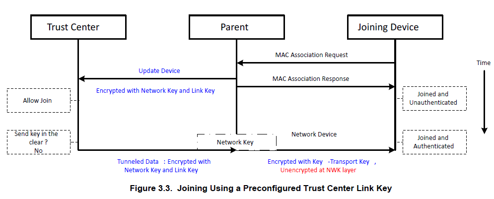

# UG103.2: Zigbee Fundamentals

### 5.2 Zigbee Profiles

Before Zigbee 3.0, application profiles, or simply profiles, sat on top of the basic Zigbee stack. These were developed to specify the OTA messages required for device interoperability. A given application profile could be certified on either the Zigbee or Zigbee PRO stack. Now, Zigbee 3.0 has introduced an all-encompassing application layer specification for defining OTA behavior for all Zigbee application:

#### The following are the application profile groups that existed before Zigbee 3.0:

* Home Automation\(HA\)
* Smart Energy\(SE\)
* Commercial Building Automation\(CBA\)
* Telecom Application\(TA\)
* Health Care\(HC\)
* Retail
* Zigbee Light Link

The Zigbee Cluster Library\(ZCL\) forms a generic basis for the Zigbee common application layer. This library defines common elements that are shared such as data types and allows reuse of simple devices such as on/off switch protocols between different profiles.

Application profiles defined the roles and functions of devices in a Zigbee network. Two types of application profiles were administered by the Alliance:

* Public Application Profiles, 
* Manufacturer-Specific Application Profiles,

### 5.3 Zigbee Addressing Scheme

The Zigbee PRO stack uses a stochastic address assignment mechanism.

### 5.4 Extended PAN IDs

Zigbee has added an 8 byte extended PAN ID\(EPID or XPID\) to facilitate provisioning\(方便配置?\) and PAN ID conflict detection. The extended PAN ID is new included in the beacon payload, following the existing 3 bytes.

The EPID is a 64-bit value set for the entire network by the Zigbee Coordinator\(ZC\) at the time the personal area network\(PAN\) is formed and must not change while the PAN is operating\(unlike the PID\). Like the PID, all nodes within the same PAN share an EPID.

### 5.4.1 Use in Scanning / Forming / Joining Process

The following guidelines apply to EmberZNet in determining the expected behavior of a Form/Join action given a particular EPID:

* If an all-zero value is specified for extended PAN ID during FormNetwork, the stack will generate a random 64-bit value for this field.
* If an all-zero value is specified for extended PAN ID during JoinNetwork, the stack will use the 16-bit PAN ID specified in the JoinNetwork parameters as the primary criteria for selecting a network during the join process.
* If a non-zero value is specified for extended PAN ID during JoinNetwork, the stack will use the 64-bit extended PAN ID specified in the JoinNetwork parameters\(even if 16-bit PAN ID is different\) as the primary criteria for selecting a network during the join process.

5.4.2 Choosing an EPID

While the PAN ID is meant to be a randomly chosen, 16-bit value, unique to each network, the EPID is often used more like the SSID field of WiFi networks to give them a user-friendly designation\(which is often not so random and is either set by the manufacturer or the installer\). However, Silicon Labs discourages using a fixed EPID for all deployments because\(unlike the conflicts of the PAN ID\) EPID conflicts cannot be resolved if they occur at runtime\(because no other unique information exists to distinguish the PANs\). Customers wishing to use non-random EPIDs should, at minimum, scan the network\(either at the coordinator or through some external commissioning tool\) and check that the new PAN's preferred EPID is not already in use by some other PAN. One approach is to use a small set of preferred EPIDs when forming PANs so that the coordinator can have alternatives if the first choice is in conflict.

OEMs creating consumer-grade products requiring customer installation\(rather than by trained installers\) should take particular care to ensure variety of EPIDs, as two customers living next door to each other may purchase the same product for their homes and would prefer to isolate their networks from each other. If those two neighboring homes were to each use PANs with the same EPID, network difficulties would likely arise for both users because the both homes would be considered as one network, and many network address conflicts could occur.

5.4.3 EPID versus PID

* EPID is 64 bites; PID is 16 bits.
* EPID is usually used as stack's criteria for matching to requested network; PID is only used for matching criteria when EPID is all 0x00 bytes.
* EPID is only present in a few kinds of packets\(beacons, Network Update messages\); PID is present in almost all 802.15.4 frames\(except MAC ACKs\).
* EPID is used as criteria for uniquely identifying the network and for resolving conflicts of PID; PID is used for AMAC destination filtering at the radio receiver.
* EPID my help provide some indication of network's identity in the scan result; PID should always be completely random, so it is not as useful in determining which PAN is the "right one".
* EPID can be any value in range of 0x0000000000000001 to 0xFFFFFFFFFFFFFFFE \(all 0's and all F's are reserved values\); PID can be any value in the range of 0x0000 - 0xFFFE\(all F's constitute reserved value\).

## 6. Zigbee Cluster Library\(ZCL\)

6.1 Overview

In the Zigbee Cluster Library\(ZCL\), a cluster is a set of messages used to send and receive related commands and data over a Zigbee network. For example, a temperature cluster would contain all the necessary OTA messages required to send and receive information about temperature.

To facilitate learning and management, these clusters are further grouped into functional domains, such as those useful for HVAC, Security, Lighting, and so on. Developers may also define their own clusters, if the pre-defined clusters do not meet their specific application needs.

The Zigbee common application layer then references which clusters are used within certain applications, and specifieds which clusters are supported by different devices-some clusters are mandatory, others optional. In this way, the ZCL simplifies the documentation of a particular application and allows the developer to understand quickly which behaviors devices supports.

A more detailed overview of the ZCL, the format of messages within clusters, and a set of messages that may be used within any cluster are described in the Zigbee Cluster Library Specification document\(15-02017-002\). Functional domain clusters are described in separate documents, such as the Functional Domain: Generic, Security and Safety document.

Silicon Labs provides source code to easily assemble and disassemble ZCL messages, See document UG102: Application Framework Developer Guide, for more information.

### 6.2 Inside Clusters

### 6.2.1 Clients and Servers

Each cluster is divided into two ends, a client end and a server end. The client end of a cluster sends messages that may be received by the server end. The client end may also receive messages that are sent by the server end. In this sense, the client and server ends of a cluster are always complementary. In constrast to many other systems\(for example ,HTTP\), both have the same potential for sending and receiving messages: the "client"designation does not imply a subordinate or response-only status. \(相比其他协议, 例如: HTTP, 双方同时有潜在的发送和接收信息: 作为client, 不是意味着从属或仅作响应的状态\)

Because all commands have a sender and a receiver, each cluster is described in two parts - a server part and a client part, as shown in the following figure. A device supporting the server half of a cluster will communicate with a device supporting the client half of he same cluster.

This equality complicates discussions; for clarity, this document always refers to "cluster end" when one of the client or the server end must be used, "cluster ends"when speaking of both client and server ends, and "cluster server" or "cluster client" when a specific end is required\(usually examples\).

### 6.2.2 Attributes

An attribute is data associated with a cluster end; the server and client ends of a cluster may each possess multiple attributes.

Each attribute declares a 16-bit identifier, a data type, a read-only or read/write designator, a default value, and an indicator of whether its support by any implementation is mandatory or optional.

### 6.2.3 Commands

A command is composed of an 8-bit command-identifier and a payload format. Like attributes, the 8-bit identifier is unique only within the specific cluster end. The payload format is arbitrary to the command type, conforming only to the general packet format guidelines as described in the ZCL Specification.

Commands are divided into two types: global and cluster-specific. Global commands are defined in the ZCL Specification and are not specific to any cluster. These global commands were originally referred to as Profile-Wide, but have changed ame to fall in line with the Zigbee 3.0 common application layer. Cluster-specific commands are defined inside the cluster definitions in the ZCL functional domain documents, and are unique to the cluster in which they are defined.

#### Global Commands

Global commands are not unique to a specific cluster; they are defined in the ZCL General Command Frame\(see ZCL Specification 075123r02, Chapter 7\). The following table lists example profile-wide command:

|   |  |
| :--- | :--- |
| **Messages Sent to the Cluster End Supporting the Attribute** | **Message Send From the Cluster End Supporting the Attribute** |
| Read Attributes | Read Attributes Response |
| Write Attributes | Write Attributes Response/No Response |
| Write Attributes Undivided | Write Attributes Response/No Response |
| Configure Reporting | Configure Reporting Response |
| Read Reporting Configuration | Read Reporting Configuration Response |
| Discover Attributes | Discover Attributes Response |
| Report Attributes | Report Attributes |
| Default Response | Default Response |

* Read Attributes: Requests one or more attributes to be returned by the recipient; replies with Read Attributes Response.
* Write Attributes: Provides new values for one or more attributes on the recipient; the reply will contain a Write Attributes Response portion indicating which attributes were successfully updated, and/or a Write Attributes No Response portion for attributes that were not successfully updated.
* 
* 

#### Cluster-Specific Commands

The payload format, support requirements\(mandatory, optional\), and behavior on receipt of a cluster-specific command are all defined in the cluster definition. typically, these commands affect the state of the receiving device and may alter the attributes of the cluster as a side-effect.

For example, the ZCL defines three commands\(OFF, ON, and TOGGLE\) that are received by the On/Off cluster server. It further declares that each of these commands is mandatory and the payload format for each command\(in this case, none of them have payloads\). The ZCL defines that the On/Off cluster client is responsible for generating the commands received by the server.

### 6.3 Example: Temperature Measurement Sensor Cluster

### 6.4 Functional Domains

As of this writing, the Zigbee Cluster Library defines the following functional domains:

* General
* Closures
* HVAC
* Lighting
* Measurement & Sensing
* Security & Safety
* Protocol Interfaces
* Smart Energy
* Over-the-Air Upgrading
* Telecommunications
* Commissioning
* Retail
* Appliances

Each domain defines a number of clusters that are then used by the Zigbee Application Layer to describe the OTA behavior of devices\(see the following figure\).

### 6.5 Manufacturer Extensions

The ZCL allows extension of the existing library in two ways: users may add manufacturer specific commands or attributes to existing clusters, or they may define entirely new clusters that are manufacturer specific.

manufacturer-specific commands are identified by setting a special bit the ZCL header and including the manufacturer code\(received from the Zigbee Alliance\) in the ZCL header. This guarantees that manufacturer-specific extensions do not interfere with other manufacturer-specific extensions or existing ZCL clusters, commands, or attributes.

Manufacturer-specific clusters must use the cluster ID range of 0xFC00-0xFFFE.

## 7. Zigbee Compliance

## 8. Zigbee 3.0

Zigbee 3.0 marks the beginning of a new chapter in the Zigbee Alliance. Zigbee 3.0 unites all of the different application profiles into one common application layer. Furthermore, it introduces greater test coverage for product certification, ensuring better interoperability for Zigbee devices in the field. The Zigbee 3.0 document suite contains both revised and completely new material for the Zigbee application specification.

The **Base Device Behavior Specification\(BDB\)** is perhaps the most important new document in the Zigbee 3.0 document suite. It specifies mandatory and optional application layer behavior for any Zigbee product. These behaviors include , but are not limited to:

* Network commissioning
* Network security
* ZDO command handling
* Reporting
* MAC data polling
* Persistent data

See document 13-0402 for more specific information on these items. Because there is now one specification for all Zigbee applications, two different Zigbee 3.0-compliant products in different application domains can interoperate on the same network\(for example, a light switch and a garage door opener can perform separate functions on the same network\).

At the heart of the BDB are the commissioning methods that a Zigbee 3.0 device can use. The methods follow an order of execution, but they are all optional for a device. For example, it may only makes sense for a Zigbee End Device switch application to performing touchlink commissioning, classical joining, and then finding and binding. On the other hand, a Zigbee coordinator gateway application may only wish to form a network. Lastly, maybe a Zigbee Router light application could perform classical joining, and then fall back to classical network formation if it does not find any networks to join. The commissioning methods, and order, are as follows.

* Touchlink commissioning
* Classical network joining
* classical network formation
* Finding and binding

Touchlink commissioning is the first step in the Zigbee 3.0 network commissioning process. A device may choose to perform the touchlink process for an initiator to try and find a touchlink target. A typical example of this interaction may be a switch and a light. The switch may perform touchlink commissioning to establish itself on the same network as the light. See 13-0402 for a more in-depth description of touchlink commissioning.

The next step in the BDB defined process is classical joining. This means finding open networks and joining one using the original Zigbee joining process. Finding a network involves performing IEEE 802.15.4 active scans on a product-defined set of channels. Once a device has found a network that it wishes to join, it may join that network using an install code derived link key, a default link key for a centralized security network, and a default link key for a distributed security network. For more information on the security mechanisms involved in the Zigbee 3.0 application layer, see **UG103.5: Security Fundamentals.**

A zigbee 3.0 application may then choose to form a classical Zigbee network. A product may form a centralized security network as a trust center or form a distributed security network as a router. This is different form many legacy application profiles where only a Zigbee coordinator could form a network. A light may wish to form a network as a router so that it can act as a touchlink target,  whereas it makes more sense for a gateway to form a centralized network as a trust center. Trust centers may choose to only allow only certain devices on the network by using **install code derived link keys** for joining\(信任中心可以选择仅允许网络上的特定设备，方法是使用**安装代码派生的链接键**进行连接。\). Again, see UG103.5: Security Fundamentals for a thorough discussion of Zigbee 3.0 security.

Once devices are on a network, they can perform finding and binding, where devices create bindings to establish application layer links.

For example, an On/Off switch may perform finding and binding to create a binding to an On/Off Light. Again, as all commissioning steps, this step is optional.

As mentioned previously, Zigbee 3.0 also introduces more stringent testing on products. This means products will go through more negative test cases and specific cluster functionality test before they are allowed on the market. Included in the Zigbee 3.0 document suite are the new Cluster Test Specifications. These documents contain test cases for Zigbee products implementing certain clusters. For a product using a certain cluster to be Zigbee 3.0 certified, it must pass the test cases contained within this document for that specific cluster. There is an individual Zigbee document for each cluster test spec. For an example, see document 15-0310, the On/Off Cluster test specification.

Zigbee 3.0 also mandates that devices should support proxy functionality for Green Power, a networking and application-level specification designed for energy-harvesting end devices. Essentially, this means that every Zigbee 3.0 device will be able to process  and forward Green Power messages to other devices with more application-layer Green Power functionality. The Green Power Basic specification and test specification are included i the Zigbee 3.0 document suite.

It is worth mentioning that the 6th revision of the Zigbee Cluster Library\(document 15-02017\) is also included in the Zigbee 3.0 document suite. See section 6. Zigbee Cluster Library for more information about this specification.

