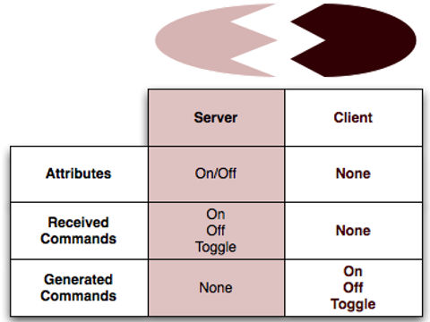

# UG103.2: Zigbee Fundamentals

### 5.2 Zigbee Profiles

Before Zigbee 3.0, application profiles, or simply profiles, sat on top of the basic Zigbee stack. These were developed to specify the OTA messages required for device interoperability. A given application profile could be certified on either the Zibee or Zigbee PRO stack. Now, Zigbee 3.0 has introduced an all-encompassing application layer specification for defining OTA behavior for all Zigbee application:

#### The following are the application profile groups that existed before Zigbee 3.0:

* Home Automation\(HA\)
* Smart Energy\(SE\)
* Commercial Building Atuomation\(CBA\)
* Telecom Application\(TA\)
* Health Care\(HC\)
* Retail
* Zigbeee Light Link

The Zigbee Cluster Library\(ZCL\) forms a generic basis for the Zigbee common application layer. This library defines common elements that are shared such as data types and allows reuse of simple devices such as on/off switch protocols between different profiles.

Application profiles defined the roles and functions of devices in a Zigbee network. Two types of application profiles were administered by the Alliance:

* Public Application Profiles, 
* Manufacturer-Specific Application Profiles,

### 5.3 Zigbee Addressing Scheme

The Zigbee PRO stack uses a stochastic address assignment mechanism.

### 5.4 Extended PAN IDs

Zigbee has added an 8 byte extended PAN ID\(EPID or XPID\) to facilitate provisioning\(方便配置?\) and PAN ID conflict detection. The extended PAN ID is new included in the beacon payload, following the existing 3 bytes.

The EPID is a 64-bit value set for the entire network by the Zigbee Coordinator\(ZC\) at the time the personal area network\(PAN\) is formed and must not change while the PAN is operating\(unlike the PID\). Like the PID, all nodes within the same PAN share an EPID.

### 5.4.1 Use in Scanning / Forming / Joining Process

The following guidelines apply to EmberZNet in determining the expected behavior of a Form/Join action given a particular EPID:

* If an all-zero value is specified for extended PAN ID during FormNetwork, the stack will generate a random 64-bit value for this field.
* If an all-zero value is specified for extended PAN ID during JoinNetwork, the stack will use the 16-bit PAN ID specified in the JoinNetwork parameters as the primary criteria for selecting a network during the join process.
* If a non-zero value is specified for extended PAN ID during JoinNetwork, the stack will use the 64-bit extended PAN ID specified in the JoinNetwork parameters\(even if 16-bit PAN ID is different\) as the primary criteria for selecting a network during the join process.

5.4.2 Choosing an EPID

While the PAN ID is meant to be a randomly chosen, 16-bit value, unique to each network, the EPID is often used more like the SSID field of WiFi networks to give them a user-friendly designation\(which is often not so random and is either set by the manufacturer or the installer\). However, Silicon Labs discourages using a fixed EPID for all deployments because\(unlike the conflicts of the PAN ID\) EPID conflicts cannot be resolved if they occur at runtime\(because no other unique information exists to distinguish the PANs\). Customers wishing to use non-random EPIDs should, at minmum, scan the network\(either at the coordinator or throught some external commissioning tool\) and check that the new PAN's preferred EPID is not already in use by some other PAN. One approach is to use a small set of prferred EPIDs when forming PANs so that the coordinator can have alternatives if the first choice is in conflict.

OEMs creating consumer-grade products requiring customer installation\(rather than by trained installers\) should take particular care to ensure variety of EPIDs, as two customers living next door to each other may purchase the same product for their homes and would prefer to isolate their networks from each other. If those two neighboring homes were to each use PANs with the same EPID, network difficulties would likely arise for both users because the both homes would be considered as one network, and many network address conflicts could occur.

5.4.3 EPID versus PID

* EPID is 64 bites; PID is 16 bits.
* EPID is ususally used as stack's citeria for matching to requested network; PID is only used for matching criteria whe EPID is all 0x00 bytes.
* EPID is only present in a few kinds of packets\(beacons, Network Update messages\); PID is present in almost all 802.15.4 frames\(except MAC ACKs\).
* EPID is used as criteria for uniquely identifying the network and for resolving conflicats of PID; PID is used for AMAC destination filtering at the radio receiver.
* EPID my help provide some indication of network's identity in the scan result; PID should always be completely random, so it is not as useful in determining which PAN is the "right one".
* EPID can be any alue in range of 0x0000000000000001 to 0xFFFFFFFFFFFFFFFE \(all 0's and all F's are reserved values\); PID can be any value in the range of 0x0000 - 0xFFFE\(all F's constitute reserved alue\).

## 6. Zibgee Cluster Library\(ZCL\)

6.1 Overview

In the Zigbee Cluster Library\(ZCL\), a cluster is a set of messages used to send and receive ralted commands and data over a Zigbee network. For example, a temperature cluster would contain all the necssary OTA messages required to send and receive information about termperature.

To facilitate learning and management, these clusters are further grouped into functional domains, such as those useful for HVAC, Security, Lighting, and so on. Developers may also define their own clusters, if the pre-deined clusters do not meet their specific application needs.

The Zigbee common application layer then references which clusters are used within certain applications, and specifieds which clusters are supported by different devices-some clusters are mandatory, others optional. In this way, the ZCL simplifies the documentation of a particular application and allows the developer to understand quickly which behaviors devices supports.

A more detailed overview of the ZCL, the format of messages within clusters, and a set of messages that may be used within any cluster are described in the Zigbee Cluster Library Specification document\(15-02017-002\). Functional domain clusters are described in separate documents, such as the Functional Domain: Generic, Security and Safety document.

Silicon Labs provides source codeto easily assemble and disassemble ZCL messages, See document UG102: Applicaiton Framework Developer Guide, for more information.

### 6.2 Inside Clusters

### 6.2.1 Clients and Servers

Each cluster is divided into two ends, a client end and a server end. The client end of a cluster sends messages that may be received by the server end. The client end may also receive messages that are sent by the server end. In this sense, the client and server ends of a cluster are always complementary. In constrast to many other systems\(for example ,HTTP\), both have the same potential for sending and receiving messages: the "client"desgnation does not imply a subordinate or response-only status. \(相比其他协议, 例如: HTTP, 双方同时有潜在的发送和接收信息: 作为client, 不是意味着从属或仅作响应的状态\)

Because all commands have a sender and a receiver, each cluster is described in two parts - a server part and a client part, as shown in the following figure. A device supporing the server half of a cluster will communicate with a device supporing the client half of he same cluster.

This equality complicates discussions; for clarity, this document always refers to "cluster end" when one of the client or the server end must be used, "cluster ends"when speaking of both client and server ends, and "cluster server" or "cluster client" when a specific end is required\(ususally examples\).

### 6.2.2 Attributes

An attribute is data associated with a cluster end; the server and client ends of a cluster may each possess multiple attributes.

Each attribute declares a 16-bit identifier, a data type, a read-only or read/write designator, a default value, and an indicator of whether its support by any implementation is mandatory or optional.

### 6.2.3 Commands

A command is composed of an 8-bit command-identifier and a payload format. Like attributes, the 8-bit identifier is unique only within the specific cluster end. The payload format is arbitrary to the command type, conforming only to the general packet format guidelines as described in the ZCL Specification.

Commands are divided into two types: global and cluster-specific. Global commands are defined in the ZCL Specification and are not specific to any cluster. These global commands were originally referred to as Profile-Wide, but have changed ame to fall in line with the Zigbee 3.0 common application layer. Cluster-specific commands are defined inside the cluster definitions in the ZCL functional domain documents, and are unique to the cluster in which they are defined.

#### Global Commands

Global commands are not unique to a specific cluster; they are defined in the ZCL General Command Frame\(see ZCL Specification 075123r02, Chapter 7\). The following table lists example profile-wide command:

|   |  |
| :--- | :--- |
| **Messages Sent to the Cluster End Supporting the Attribute** | **Message Send From the Cluster End Supporting the Attribute** |
| Read Attributes | Read Attributes Response |
| Write Attributes | Write Attributes Response/No Response |
| Write Attributes Undivided | Write Attributes Response/No Response |
| Configure Reporting | Configure Reporting Response |
| Read Reporting Configuration | Read Reporting Configuration Response |
| Discover Attributes | Discover Attributes Response |
| Report Attributes | Report Attributes |
| Default Response | Default Response |

